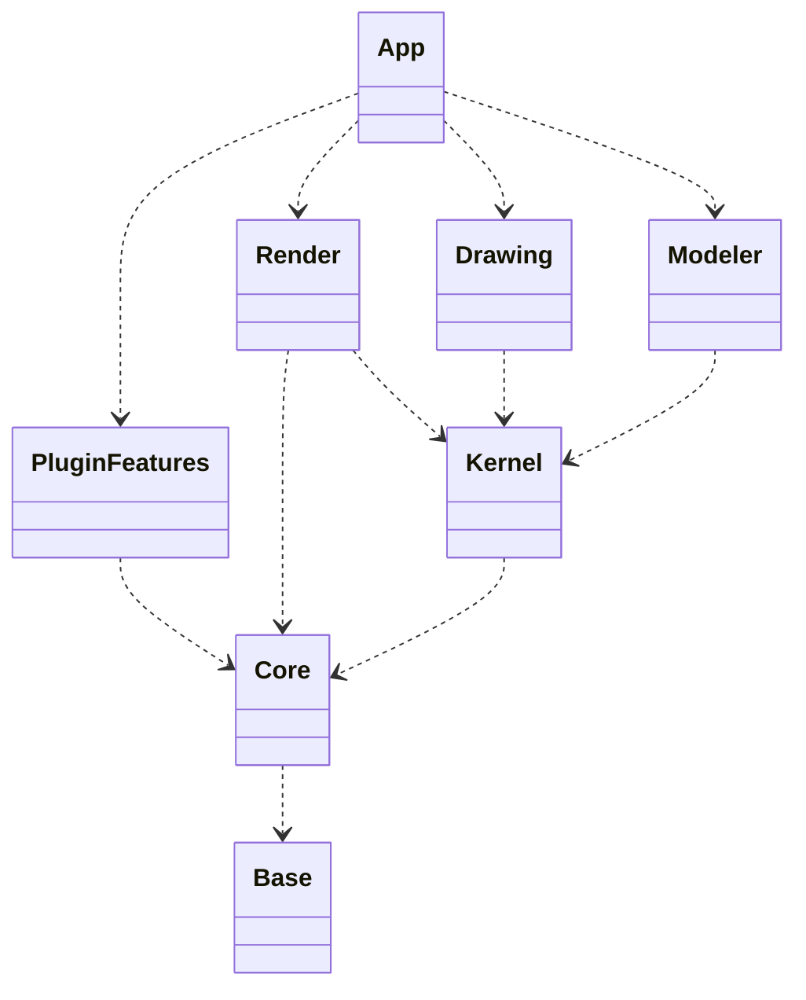
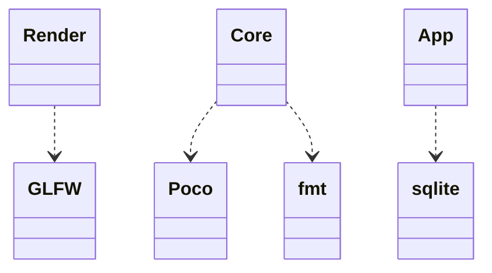
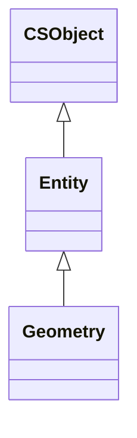
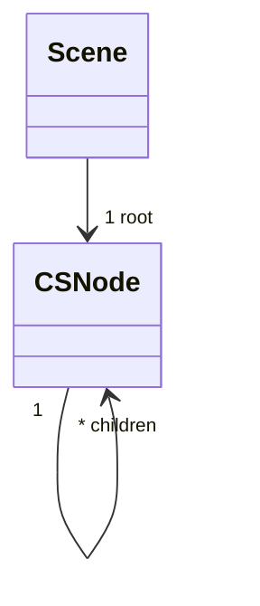

```mermaid
classDiagram
 App ..> Render
 App ..> Modeler
 App ..> Drawing
 App ..> PluginFeatures
 PluginFeatures ..> Core
 Render ..> Core
 Render ..> Kernel
 Drawing ..> Kernel
 Modeler ..> Kernel
 Core ..> Base
 Kernel ..> Core
```

Package dependency

```mermaid
classDiagram
 Render ..> GLFW
 Core ..> Poco
 Core ..> fmt
 App ..> sqlite
```

primary classes

```mermaid
classDiagram
 graph TB
 CSObject <|-- Entity
 Entity <|-- Geometry
```

scene

```mermaid
classDiagram
  CSNode "1" --> "* children" CSNode
  Scene --> "1 root" CSNode
```
